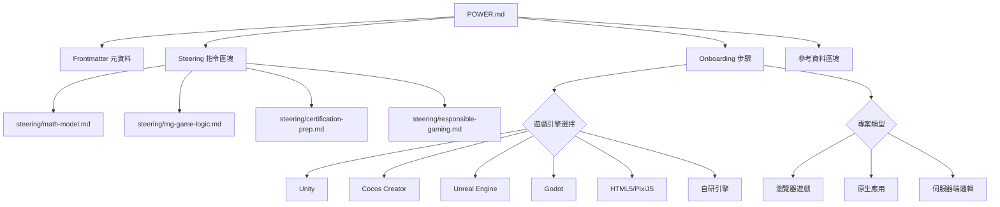

# 設計文件：老虎機開發專家 Kiro Power

## 概述

本設計文件描述一個純文件型 Kiro Power 的架構與內容組織方式。此 Power 不包含 MCP 伺服器或可執行程式碼，而是透過 `POWER.md` 主定義檔與 `steering/` 目錄下的工作流程指引檔案，將老虎機開發領域的專業知識封裝為 Kiro 可消費的結構化內容。

安裝後，Kiro 將具備以下能力：
- 指導 RNG（隨機數生成器）的密碼學安全實作
- 協助設計數學模型（Paytable、Reel Strip、RTP、Volatility）
- 引導完整的 Spin Lifecycle 實作
- 提供 GLI-11/GLI-19 認證合規指導
- 建議負責任博弈功能的實作方式
- 依據專案類型推薦 2026 年適用的技術棧

本 Power 的所有知識內容均標註 2024–2026 年間的可靠資料來源。

## 架構

本 Power 採用 Kiro Power 標準檔案架構，由一個主定義檔與多個 Steering 指引檔組成。



### 設計決策

1. **純文件架構（無 MCP 伺服器）**：老虎機開發指導的核心價值在於領域知識的傳遞，而非工具自動化。Steering 檔案足以涵蓋所有工作流程情境，無需額外的伺服器端邏輯。

2. **四個 Steering 檔案的劃分**：依據老虎機開發的四大核心階段劃分——數學模型設計、RNG 與遊戲邏輯實作、認證準備、負責任博弈。每個檔案對應一個獨立的開發工作流程，避免單一檔案過於龐大。

3. **Onboarding 引導遊戲引擎與專案類型**：不同遊戲引擎（Unity、Cocos Creator、Unreal Engine、Godot、HTML5/PixiJS、自研引擎）的技術棧、RNG 整合方式與實作細節差異顯著，透過 Onboarding 步驟在安裝時確認遊戲引擎與專案類型，使後續指導更具針對性。

4. **參考資料內嵌於 POWER.md**：將所有資料來源集中於主檔案的參考資料區塊，便於維護與更新，同時確保每條知識可追溯。

## 元件與介面

### 1. POWER.md 主定義檔

此檔案為 Power 的進入點，包含以下區塊：

#### Frontmatter 區塊
```yaml
---
name: slot-machine-expert
displayName: 老虎機開發專家
description: 使 Kiro 成為老虎機遊戲開發的專業顧問，涵蓋 RNG、數學模型、認證合規與負責任博弈
keywords:
  - slot machine
  - gambling
  - RNG
  - certification
  - GLI-11
  - responsible gaming
  - Unity
  - Cocos Creator
  - Unreal Engine
  - Godot
  - PixiJS
---
```

#### Onboarding 區塊
定義四個引導步驟：
1. 確認遊戲引擎（Unity / Cocos Creator / Unreal Engine / Godot / HTML5/PixiJS / 自研引擎）
2. 確認專案類型（瀏覽器遊戲 / 原生應用 / 伺服器端邏輯）
3. 確認目標市場（影響合規要求）
4. 確認開發階段（新專案 / 既有專案改進）

#### Steering 指令區塊
宣告四個 Steering 檔案的觸發條件與用途：
- `steering/math-model.md`：數學模型設計相關問題時觸發
- `steering/rng-game-logic.md`：RNG 或遊戲邏輯實作相關問題時觸發
- `steering/certification-prep.md`：認證或合規相關問題時觸發
- `steering/responsible-gaming.md`：負責任博弈功能相關問題時觸發

#### 參考資料區塊
列出所有知識來源的 URL 與發布年份（限 2024–2026 年）。

### 2. steering/math-model.md

涵蓋數學模型設計的完整工作流程：

| 主題 | 內容 |
|------|------|
| Paytable 設計 | 符號組合定義、獎金倍數設定、RTP 驗算方法 |
| Reel Strip 配置 | Virtual Reel 加權映射、符號權重分配 |
| RTP 計算 | 基礎遊戲 RTP + 獎勵功能 RTP 的整合計算 |
| Volatility 調校 | 高/中/低波動性的符號權重分佈策略 |
| Hit Frequency | 計算公式與目標範圍建議 |
| 獎勵功能設計 | Free Spin、Bonus Round、Multiplier、Progressive Jackpot 的 RTP 貢獻計算 |

### 3. steering/rng-game-logic.md

涵蓋 RNG 實作與遊戲邏輯的完整工作流程：

| 主題 | 內容 |
|------|------|
| CSPRNG 選擇 | 各引擎推薦演算法：Unity → System.Security.Cryptography、Cocos Creator → Web Crypto API / Node.js crypto、Unreal Engine → FMath::RandRange + OpenSSL、Godot → Crypto class、HTML5/PixiJS → Web Crypto API、伺服器端 → os.urandom / crypto.randomBytes |
| 種子管理 | 熵值來源、種子更新策略 |
| 旋轉獨立性 | 確保每次旋轉結果不受前次影響的實作方式 |
| Spin Lifecycle | 六階段實作指引（請求接收→RNG→映射→規則評估→獎勵解析→結果返回） |
| 規則引擎 | Payline 匹配、Wild 替代、Scatter 觸發、Multiplier 套用的評估順序 |
| 審計日誌 | 日誌格式、必要欄位、儲存策略 |

### 4. steering/certification-prep.md

涵蓋認證準備的完整工作流程：

| 主題 | 內容 |
|------|------|
| GLI-11 合規 | 電子博弈機技術標準要求 |
| GLI-19 合規 | 遠端遊戲伺服器技術標準要求 |
| 文件準備 | RNG 驗證報告、RTP 證明、功能邏輯說明等七項文件 |
| 市場監管 | 各司法管轄區監管機構與特定要求 |
| 時程與費用 | 認證時程預估與費用範圍 |
| RTP 門檻警告 | RTP < 92% 時的市場限制提醒 |

### 5. steering/responsible-gaming.md

涵蓋負責任博弈功能的完整工作流程：

| 主題 | 內容 |
|------|------|
| 存款限制 | 每日/每週/每月投注上限的實作指引 |
| 自我排除 | 暫停與永久停止機制的實作指引 |
| 會話時間限制 | 遊戲時間提醒機制的實作指引 |
| 勝負追蹤 | 即時淨盈虧顯示的實作指引 |
| 自動播放管控 | 依市場規範調整或移除自動播放的指引 |
| 風險訊息顯示 | RTP 百分比與博弈風險提示的 UI 指引 |


## 資料模型

本 Power 為純文件型，不涉及資料庫或持久化儲存。以下定義的是 Power 檔案中使用的結構化資料格式。

### POWER.md Frontmatter 結構

```yaml
name: string          # Power 識別名稱（kebab-case）
displayName: string   # 顯示名稱
description: string   # Power 描述
keywords: string[]    # 搜尋關鍵字陣列
```

### Onboarding 步驟結構

每個 Onboarding 步驟包含：
- `prompt`：向開發者顯示的問題文字
- `options`：可選的預設選項列表
- `variable`：儲存開發者回答的變數名稱

### Steering 指令結構

每個 Steering 指令包含：
- `file`：指向 steering/ 目錄下的檔案路徑
- `trigger`：觸發此 Steering 的條件描述
- `description`：此 Steering 的用途說明

### 審計日誌資料格式

Steering 中建議的旋轉審計日誌格式：

```typescript
interface SpinAuditLog {
  spinId: string;           // 唯一旋轉識別碼
  timestamp: string;        // ISO 8601 時間戳記
  sessionId: string;        // 會話識別碼
  playerId: string;         // 玩家識別碼
  betAmount: number;        // 投注金額
  betLines: number;         // 投注賠線數
  rngOutput: number[];      // RNG 原始輸出值
  reelStops: number[];      // 捲軸停止位置
  visibleSymbols: string[][]; // 可見符號矩陣
  winLines: WinLine[];      // 獲勝賠線詳情
  totalWin: number;         // 總獎金金額
  bonusTriggered: boolean;  // 是否觸發獎勵回合
  balanceBefore: number;    // 旋轉前餘額
  balanceAfter: number;     // 旋轉後餘額
}

interface WinLine {
  lineId: number;           // 賠線編號
  symbols: string[];        // 匹配符號
  matchCount: number;       // 匹配數量
  multiplier: number;       // 適用乘數
  payout: number;           // 該線獎金
}
```

### RTP 計算模型

Steering 中建議的 RTP 計算結構：

```typescript
interface RTPCalculation {
  baseGameRTP: number;      // 基礎遊戲 RTP（百分比）
  freeSpinRTP: number;      // 免費旋轉貢獻 RTP
  bonusRoundRTP: number;    // 獎勵回合貢獻 RTP
  progressiveRTP: number;   // 累積獎金貢獻 RTP
  totalRTP: number;         // 總 RTP = 各項加總
  hitFrequency: number;     // 命中頻率（百分比）
  volatilityIndex: number;  // 波動性指數
}
```

### Reel Strip 配置模型

```typescript
interface ReelStripConfig {
  reelIndex: number;              // 捲軸編號（0-based）
  symbols: string[];              // 實體捲軸符號序列
  virtualReel: VirtualReelEntry[]; // 虛擬捲軸加權映射
  totalWeight: number;            // 總權重值
}

interface VirtualReelEntry {
  symbol: string;    // 符號名稱
  weight: number;    // 該符號的權重值
  probability: number; // 出現機率 = weight / totalWeight
}
```


## 正確性屬性

*正確性屬性（Correctness Property）是一種在系統所有有效執行中都應成立的特徵或行為——本質上是對系統應做之事的形式化陳述。屬性作為人類可讀規格與機器可驗證正確性保證之間的橋樑。*

### 屬性 1：POWER.md 結構完整性

*對於任何* 有效的 POWER.md 檔案，解析後必須包含 frontmatter 區塊（含 `name`、`displayName`、`description`、`keywords` 四個欄位）以及至少一個 Steering 指令區塊。

**驗證需求：1.1**

### 屬性 2：Hit Frequency 計算公式不變量

*對於任何* 捲軸配置，計算所得的 Hit Frequency 必須等於 `(總獲勝組合數 ÷ 總可能組合數) × 100`，且結果為 0 至 100 之間的百分比值。

**驗證需求：3.3**

### 屬性 3：RTP 加總不變量

*對於任何* 包含獎勵功能的遊戲配置，總 RTP 必須等於基礎遊戲 RTP 加上所有獎勵功能（Free Spin、Bonus Round、Multiplier、Progressive Jackpot）的 RTP 貢獻之總和。

**驗證需求：3.5**

### 屬性 4：Virtual Reel 映射有效性

*對於任何* RNG 輸出值與 Virtual Reel 權重配置，映射函數產生的捲軸停止位置必須落在該捲軸帶的有效索引範圍內（0 至 reelStrip.length - 1）。

**驗證需求：4.3**

### 屬性 5：審計日誌欄位完整性

*對於任何* 旋轉審計日誌條目，必須包含以下所有欄位：時間戳記（timestamp）、投注金額（betAmount）、RNG 輸出（rngOutput）、最終結果（visibleSymbols + winLines）與獎金金額（totalWin）。

**驗證需求：4.5**

### 屬性 6：低 RTP 警告觸發

*對於任何* RTP 設定值，若該值低於 92%，系統指導內容必須包含市場限制警告；若該值大於或等於 92%，則不應觸發此警告。

**驗證需求：5.5**

### 屬性 7：會話淨盈虧計算不變量

*對於任何* 旋轉序列，會話淨盈虧金額必須等於該序列中所有獎金之總和減去所有投注金額之總和，即 `netAmount = Σ(wins) - Σ(bets)`。

**驗證需求：6.4**

### 屬性 8：遊戲引擎與技術棧映射一致性

*對於任何* 遊戲引擎輸入，推薦的技術棧必須符合以下映射：Unity → C#、Cocos Creator → TypeScript、Unreal Engine → C++/Blueprint、Godot → GDScript/C#、HTML5/PixiJS → JavaScript/TypeScript、伺服器端邏輯 → Python、多人即時功能 → Node.js。

**驗證需求：7.1**

### 屬性 9：參考資料條目有效性

*對於任何* POWER.md 參考資料區塊中的條目，必須包含有效的 URL 與發布年份，且發布年份必須介於 2024 至 2026 之間（含）。

**驗證需求：9.1, 9.3**

## 錯誤處理

由於本 Power 為純文件型（無可執行程式碼），錯誤處理主要針對內容層面的防護機制：

### 1. Onboarding 輸入驗證
- 若開發者在 Onboarding 步驟中未選擇遊戲引擎，POWER.md 應提供預設指引（以 HTML5/PixiJS 為預設）
- 若開發者指定的目標市場不在已知清單中，Steering 應建議開發者自行查詢該市場的監管機構

### 2. 數學模型邊界條件
- Steering 應提醒開發者：RTP 計算結果若超出 85%–99% 範圍，可能存在配置錯誤
- Steering 應提醒開發者：Hit Frequency 若低於 10% 或高於 60%，應重新檢視符號權重分佈
- Steering 應提醒開發者：Virtual Reel 總權重不應為零

### 3. 認證準備缺漏檢查
- Steering 應提供認證文件檢查清單，協助開發者識別遺漏的文件項目
- 若開發者的 RTP 設定低於 92%，Steering 應主動發出警告（對應屬性 6）

### 4. 負責任博弈合規缺漏
- Steering 應提供負責任博弈功能檢查清單，確保所有必要功能均已實作
- 若目標市場禁止自動播放，Steering 應明確提醒開發者移除相關功能

## 測試策略

### 測試方法

本 Power 採用雙軌測試方法：

1. **單元測試（Unit Tests）**：驗證特定範例、邊界條件與錯誤情境
2. **屬性測試（Property-Based Tests）**：驗證跨所有輸入的通用屬性

兩者互補，共同提供全面的覆蓋率。

### 屬性測試框架

- **目標語言**：TypeScript（與 Kiro Power 生態系一致）
- **屬性測試函式庫**：[fast-check](https://github.com/dubzzz/fast-check)
- **每個屬性測試最少執行 100 次迭代**
- **每個測試必須以註解標記對應的設計屬性**
- 標記格式：`Feature: slot-machine-expert-power, Property {number}: {property_text}`
- **每個正確性屬性由單一屬性測試實作**

### 單元測試範圍

| 測試類別 | 測試內容 |
|----------|----------|
| POWER.md 結構 | 驗證 frontmatter 欄位存在、Steering 指令格式正確、參考資料區塊存在 |
| Steering 檔案存在性 | 驗證四個 Steering 檔案均存在且非空 |
| Onboarding 完整性 | 驗證四個 Onboarding 步驟均包含必要的選項（含六種遊戲引擎選項） |
| 內容覆蓋率 | 驗證各 Steering 檔案涵蓋需求中指定的所有主題 |
| Spin Lifecycle 階段 | 驗證 RNG Steering 檔案涵蓋全部六個旋轉階段 |
| 認證文件清單 | 驗證認證 Steering 檔案涵蓋全部七項文件類型 |
| 負責任博弈功能 | 驗證負責任博弈 Steering 檔案涵蓋全部六項功能 |
| 2026 趨勢 | 驗證技術棧建議涵蓋全部五項趨勢 |

### 屬性測試範圍

| 屬性 | 測試策略 |
|------|----------|
| 屬性 1：POWER.md 結構完整性 | 生成隨機 frontmatter 內容，驗證解析後必含四個必要欄位 |
| 屬性 2：Hit Frequency 公式 | 生成隨機捲軸配置（符號數量、獲勝組合），驗證計算結果符合公式 |
| 屬性 3：RTP 加總 | 生成隨機基礎 RTP 與多個獎勵 RTP 值，驗證總和等式成立 |
| 屬性 4：Virtual Reel 映射 | 生成隨機 RNG 值與權重配置，驗證映射結果在有效範圍內 |
| 屬性 5：審計日誌完整性 | 生成隨機旋轉資料，驗證產生的日誌包含所有必要欄位 |
| 屬性 6：低 RTP 警告 | 生成隨機 RTP 值（0%–100%），驗證 < 92% 時觸發警告、≥ 92% 時不觸發 |
| 屬性 7：淨盈虧計算 | 生成隨機旋轉序列（投注與獎金），驗證淨額等於 Σ(wins) - Σ(bets) |
| 屬性 8：技術棧映射 | 生成隨機遊戲引擎類型，驗證推薦結果符合定義的映射表 |
| 屬性 9：參考資料有效性 | 生成隨機參考條目，驗證必含 URL 且年份在 2024–2026 範圍內 |

### 測試標記範例

```typescript
// Feature: slot-machine-expert-power, Property 3: RTP 加總不變量
test.prop(
  '總 RTP 等於基礎遊戲 RTP 加上所有獎勵功能 RTP 之總和',
  [fc.float({ min: 0, max: 100 }), fc.array(fc.float({ min: 0, max: 50 }))],
  (baseRTP, bonusRTPs) => {
    const totalRTP = calculateTotalRTP(baseRTP, bonusRTPs);
    expect(totalRTP).toBeCloseTo(baseRTP + bonusRTPs.reduce((a, b) => a + b, 0));
  }
);
```
